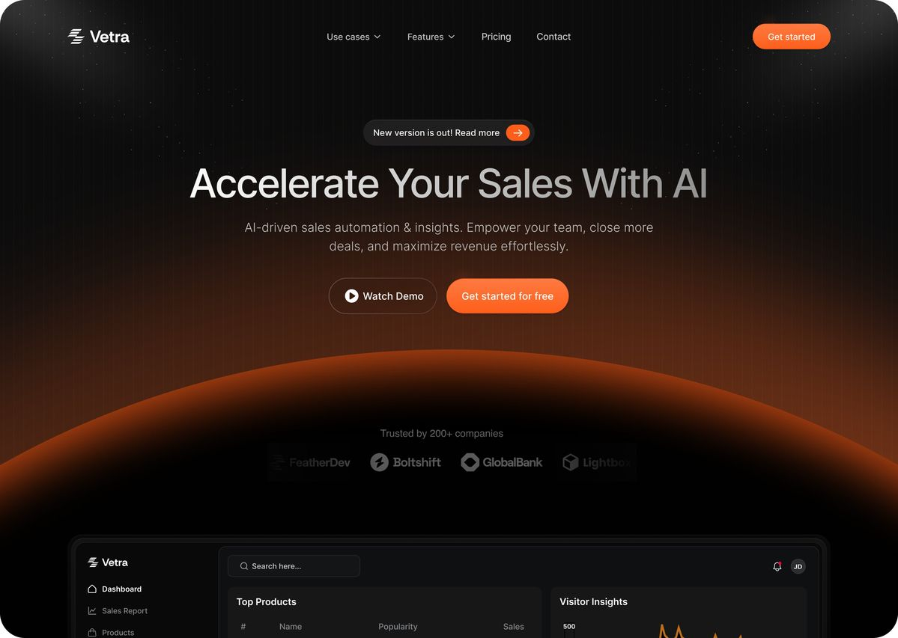

I have added the following files:

* `sandbox-api-documentation.md`
* `react-architecture.md`

I have also attached a UI reference image. 

Read everything carefully before starting.

Your task is to build a modern AI sandbox frontend application using React + TailwindCSS.

The product should feel similar in quality and experience to:

* Replit
* Lovable
* Bolt
* v0
* CodeSandbox AI

Very important:
Use the attached UI image as visual inspiration for:

* overall aesthetic
* layout density
* typography
* glow effects
* spacing
* premium feel
* dark futuristic color palette

Do NOT copy the design literally.
Adapt the same visual quality and cinematic AI-native feel for this product.

---

# Product Flow

The application should have:

## 1. Premium Landing Experience

Create a modern cinematic landing section first.

NOT a generic SaaS dashboard.

The landing experience should:

* feel futuristic
* feel premium
* feel developer-focused
* have strong visual hierarchy
* use subtle gradients/glows
* have smooth transitions/animations

Include:

* hero section
* short product description
* small feature highlights
* strong CTA button

The landing page should smoothly transition into the workspace experience.

Do NOT create a massive multi-page marketing website.

Keep it focused and premium.

---

# 2. Sandbox Workspace

After clicking the CTA:

* create a sandbox using the provided APIs
* initialize the workspace
* transition into an AI IDE-like interface

The workspace should include:

* AI chat panel
* live preview panel
* realtime terminal
* streaming AI logs

Suggested layout:

* left → AI chat
* center → preview
* bottom/right → terminal

Resizable panels are preferred.

The experience should feel like a real AI coding environment.

---

# 3. AI Chat Experience

Users should be able to:

* send prompts to AI
* generate/edit frontend apps
* view realtime AI logs
* observe streaming progress

Implement proper:

* streaming UI
* loading states
* auto-scroll
* message grouping
* smooth transitions

The chat should feel polished and production-grade.

---

# 4. Terminal Integration

Implement realtime terminal support using Socket.IO exactly as described in the API documentation.

Requirements:

* connect terminal after sandbox creation
* use sandboxId for socket host header
* render realtime terminal output
* support terminal input
* handle reconnect/disconnect states
* properly handle ANSI escape sequences

Use a proper terminal UI (xterm.js preferred).

---

# 5. Live Preview

Use the provided preview URL from the sandbox APIs.

Requirements:

* render preview in iframe
* responsive preview container
* proper loading/error handling
* smooth refresh/update experience

---

# 6. Architecture (Very Important)

Follow the architecture defined in `react-architecture.md` strictly.

Maintain proper separation between:

* UI Layer
* Hooks Layer
* State Layer
* API Layer

Do NOT mix responsibilities between layers.

The architecture was originally used with SCSS.
Adapt it properly to TailwindCSS while preserving the same architectural principles.

---

# 7. Design Direction

This should NOT look like:

* an admin dashboard
* a CRUD application
* a template clone

It SHOULD feel:

* cinematic
* futuristic
* AI-native
* premium
* interactive
* developer-centric

Use:

* dark backgrounds
* warm orange/purple glow accents
* subtle gradients
* modern typography
* clean spacing
* glassmorphism only where appropriate
* smooth hover/transition effects

Maintain readability and usability at all times.

---

# 8. Code Quality

Focus heavily on:

* scalability
* maintainability
* reusable components
* clean folder structure
* responsive design
* polished UX
* smooth state transitions

Do not just complete the task mechanically.

Think through the full developer experience and create a production-quality frontend application.
